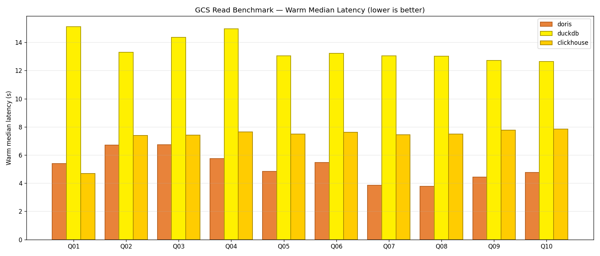
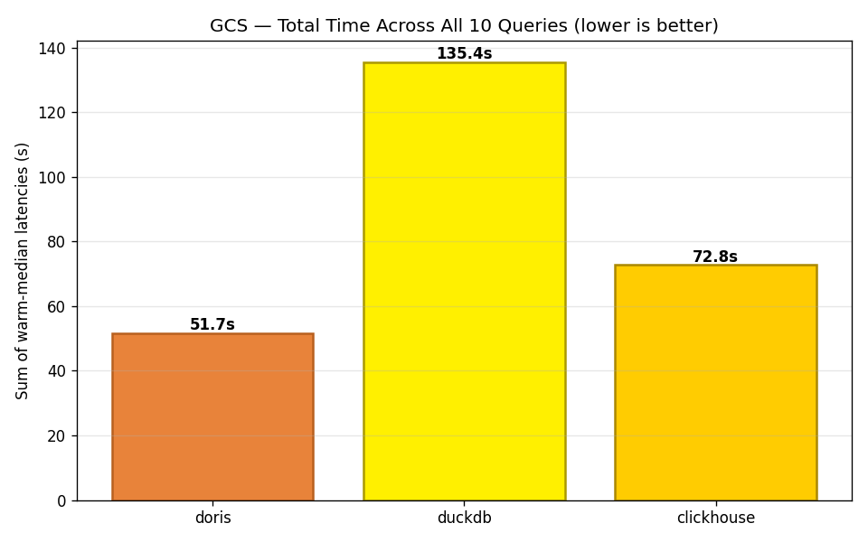
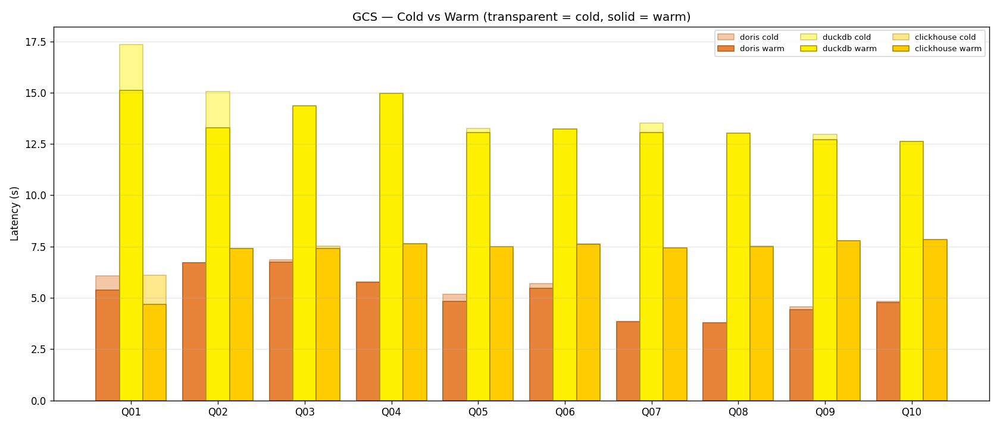

# GCS Benchmark Analysis

**Dataset:** CSV files in the `apachedorispoc` GCS bucket, accessed via HMAC credentials.
**Engines used:** Doris `s3()` TVF · DuckDB `httpfs` · ClickHouse `s3()` TVF.
**Protocol:** 1 cold + 3 warm runs per query (GCS mode). Reported metric = warm median.

## Warm median latency per query (seconds)

| Query | Doris | DuckDB | ClickHouse |
|-------|-------|--------|------------|
| GQ01 full scan agg | **5.38** | 15.12 | 4.68 |
| GQ02 filtered agg | **6.70** | 13.29 | 7.40 |
| GQ03 groupby low card | **6.74** | 14.37 | 7.42 |
| GQ04 groupby high card | **5.76** | 14.96 | 7.63 |
| GQ05 date range | **4.83** | 13.05 | 7.50 |
| GQ06 topn | **5.47** | 13.22 | 7.61 |
| GQ07 string like | **3.84** | 13.04 | 7.43 |
| GQ08 approx distinct | **3.78** | 13.03 | 7.48 |
| GQ09 window func | **4.43** | 12.71 | 7.77 |
| GQ10 heavy scan | **4.77** | 12.63 | 7.85 |
| **Total** | **51.7 s** | 135.4 s | 72.8 s |

## Cold vs Warm

On all three engines, the cold/warm gap is small (~0.1–2 s) — because the bottleneck is **network transfer**, not engine state. There is very little that local caching can save when every query re-streams the CSV from GCS.

## Why Doris is fastest over GCS

1. **Parallel part readers.** Doris's `s3()` TVF splits the CSV into ranges and fetches them in parallel threads, saturating available bandwidth faster than single-threaded clients.
2. **Minimal serialization overhead.** C++ BE parses CSV rows directly into columnar vectors — no intermediate row representation.
3. **No local persistence step.** Data flows straight into the query pipeline.

The absolute win margin (Doris ~52 s total vs ClickHouse ~73 s) is a real, reproducible ~30% lead on this VM.

## Why ClickHouse is steady but not the fastest

ClickHouse's `s3()` TVF is conservative about concurrency by default and doesn't split a single CSV file aggressively across threads. The result: very consistent ~7.4–7.9 s per query, but never as fast as Doris on the parallel-read path.

It's arguably the more **predictable** choice: warm ≈ cold ≈ 7–8 s regardless of query shape, because the CSV-read cost overwhelms everything else.

## Why DuckDB is ~2× slower on GCS

DuckDB's `httpfs` extension:
- fetches the full file via **single-threaded HTTPS**,
- doesn't persist it across queries in a way that helps repeat reads on a constrained RAM budget,
- CSV parse runs on one pipeline thread and can't overlap download + parse the way the MPP engines do.

On a 10M-row CSV this reliably costs ~13 s per query. That's not a bug — it's a design choice: DuckDB optimises for local-first workloads and treats remote reads as a convenience feature, not a primary path.

## Practical implications

**If your data lives in GCS / S3 and you're querying it directly without ingest:**
- **Doris** is the lowest-latency option on this hardware.
- **ClickHouse** is the most consistent and mature.
- **DuckDB** is workable only if latency ≥10 s per query is acceptable.

**If you have the option to ingest once and query locally many times:**
- Ingest to DuckDB and query locally — the ingestion cost is amortised immediately after 1–2 queries (DuckDB local warm ≤ 3 ms).
- ClickHouse ingest is only slightly slower; local query wins remain large.
